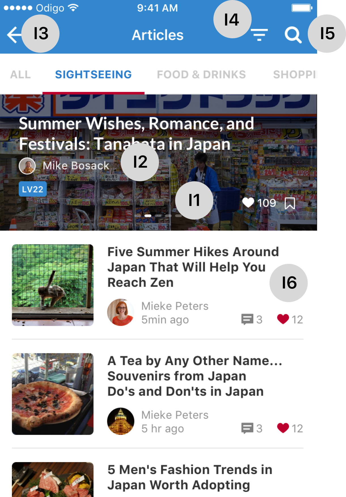
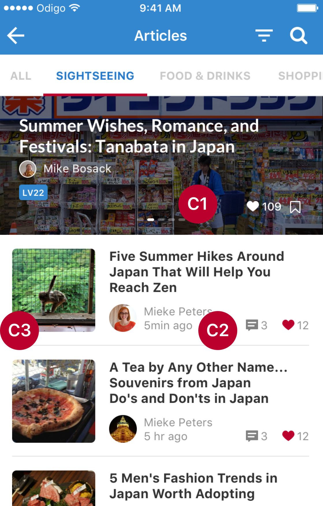

# US 22 - Sightseeing Articles iOS

|         	      |  	                                                  |
|-----------------|----------------------------------------------------	|
| **Title**       | As an user, I want to see the sightseeing articles 	|
| **Trello cards**| [N°2](https://google.fr)                              	            |
| **Developers**  | Aymen Rebouh                                       	|

## Design

 

### iPhone
<a href="#">Sketch Sightseeing Articles Screen iPhone</a>

### iPad
<a href="#">Sketch Sightseeing Articles Screen iPad</a>

## Interactions rules

<table>
<tr>
  <th>Area</th>
  <th>Interactions</th>
</tr>

<tr>
  <td><b>I1</b></td>
  <td>On swipe, show the previous ou next top article </td>
</tr>

<tr>
  <td><b>I2</b></td>
  <td>On click on the author label/pictures, redirect the user to <a href="#">US 01</a></td>
</tr>

<tr>
  <td><b>I3</b></td>
  <td>On tap, redirect the user to <a href="#">US 01</a></td>
</tr>

<tr>
  <td><b>I4</b></td>
  <td>On tap, present the picker <a href="#">US 21</a> to the user</td>
</tr>

## Core rules

<table>
<tr>
  <th>Area</th>
  <th>What do to</th>
</tr>

<tr>
  <td><b>C1</b></td>
  <td>You should display only 5 top articles</td>
</tr>

<tr>
  <td><b>C2</b></td>
    <td>By default, set a placeholder image</td>
</tr>

<tr>
  <td><b>C3</b></td>
  <td>This is the date format to take into account depending on the <b>article.creationDate</b> : 
      <ul>
        <li>Less than 1 hour : Xmin ago</li>
        <li>Less than 12 hours : Xh ago</li>
        <li>Today</li>
        <li>Yesterday</li>
        <li>Less than 10 days : X days ago</li>
        <li>day/month/year</li>
      </ul>
   </td>
</tr>
</table>

## Data source

### In

The final URL will be the **base url** indicated somewhere else **+** the service 

For example : `https://odigo.api.production/topArticlesOfTheDay`

| Feature                       | Service             | HTTP Method | Parameters                                | Content-type      |
|-------------------------------|---------------------|-------------|-------------------------------------------|-------------------|
| **Top 5 articles of the day** | topArticlesOfTheDay | GET         | category=all/sightseeing/food/shopping/...| applications/json |
| **Last 20 articles**          | lastArticles        | GET         | category=all/sightseeing/food/shopping/...| applications/json |

### Out

| Feature                       | JSON                                        |
|-------------------------------|---------------------------------------------|
| **Top 5 articles of the day** | [Top5Articles](https://link.to.jsonFile.com |
| **Last 20 articles**          | [LastArticles](https://link.to.jsonFile.com |
